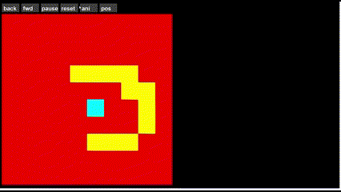
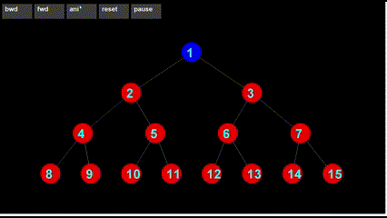

# DFSVisualizer
 This is a visualizer for DFS in a 2d array graph and a tree graph. 
## 2D Array

The 2d array visual allows you to select blocks that can be walls, it will update real time even after or during the animation, you can pause, reset, bo forward and back through the dfs pathing.

## Tree
 

The tree visualizer allows you to go through the nodes of dfs pathing, the blue nodes show the fastest path to the current node and the yellow nodes represent the visited, likewise the red are unvisited,

